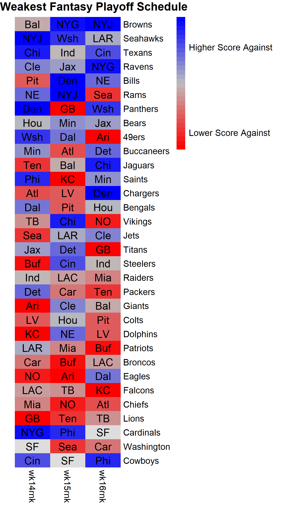

# FFb.EndSeasonDST

The R code in **playoff.DST.R** makes a heatmap showing which NFL Defense have the weakest strenth of schedule during the weeks of the fantasy playoffs. It requires two csv files as inputs, which I copy-pasted and manual cleaned from ESPN.com's NFL fantasy interface. 

* schedule.csv 
  * PLAYER - a column of the full team names. 
  * NFL Week XX - Subsequent columns for each weeks with three letter team abberviation for each oppontent. 
* Rankings.csv
  * OPP - column with each three letter team abberviation
  * OPRK - column with relative ranks (lower rank/higher number means more points scored against and therefore more sought after matchup) 
  
 A Heat map of 2020 fansty playoffs showing team defenses with easiest strength of schedule as of 2020 - 11 - 21. 
 
 
Format: 
